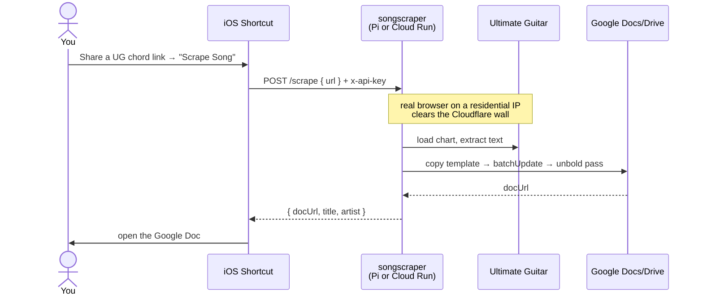

# Trigger a scrape from your phone (iOS Shortcut)

songscraper needs no app and no new code to be driven from a phone. `POST /scrape { url }` already
returns `{ docUrl, title, artist }`, so an **iOS Shortcut** can take a shared Ultimate Guitar link,
call the service, and open the finished Google Doc.

The scrape always runs **wherever the real browser lives** — your Raspberry Pi (free, residential IP)
or a managed remote browser behind Cloud Run. The phone just makes one HTTP call to it. The only thing
that changes between setups is the **URL** the Shortcut posts to.



## Pick your endpoint

| Setup | Shortcut URL | Reachable from | Notes |
|---|---|---|---|
| **Pi + [Tailscale](https://tailscale.com)** (recommended) | `http://<pi-name>.<tailnet>.ts.net:8080/scrape` | anywhere | private WireGuard link; nothing public. `http` is fine — Tailscale encrypts the transport. |
| **Pi on home Wi-Fi** | `http://<pi-lan-ip>:8080/scrape` | home network only | give the Pi a reserved IP in your router. |
| **Cloud Run** | `https://<cloud-run-url>/scrape` | anywhere | deploy with `--allow-unauthenticated`; the `x-api-key` is the auth boundary (see `DEPLOY.md` §7). |

> The `x-api-key` shared secret + UG-URL validation are the auth boundary in **every** setup. Never run
> the service without `API_KEY` set, and treat the key like a password.
>
> **Port note:** `8080` is the default. If something else already owns `8080` on your box (e.g. an
> Umbrel home server), set `PORT` in `.env` to a free port and use that in the URL instead.

### Recommended: Pi + Tailscale (free, works anywhere)

[Tailscale](https://tailscale.com) puts the Pi and your phone on the same private network from any
location, with no port-forwarding and nothing exposed to the public internet. One-time setup:

1. **On the Pi:** `curl -fsSL https://tailscale.com/install.sh | sh`, then
   `sudo tailscale up --hostname=songscraper`. Open the printed login URL and approve the machine.
2. **On the iPhone:** install **Tailscale** from the App Store, sign in with the **same account**, and
   toggle the VPN **on**.
3. **Find the Pi's name:** `tailscale status` (or the admin console) shows its MagicDNS name, e.g.
   `songscraper.tailXXXXXX.ts.net`. Your Shortcut URL is
   `http://songscraper.tailXXXXXX.ts.net:8080/scrape` (the Tailscale `100.x.y.z` IP works too).

The Pi re-joins the tailnet automatically after a reboot — no re-auth needed. Full Pi install in
**[RASPBERRY_PI.md](RASPBERRY_PI.md)**.

> **Note on Cloud Run.** A normal Cloud Run deploy cannot scrape Ultimate Guitar by itself —
> Cloudflare blocks the datacenter IP. It only works with `FETCH_STRATEGY=remote` (a paid managed
> browser with residential egress). The free path is the Pi. See the README's *Fetching past
> Cloudflare* section.

## Build the Shortcut

Open **Shortcuts → + (new) → rename it e.g. "Scrape Song"**, then add these actions in order:

1. **Settings (ⓘ at the bottom): turn on "Show in Share Sheet"**, and set *Share Sheet Types* to
   **URLs** (and optionally *Text*). This makes the Shortcut appear when you tap **Share** on a tab in
   Safari or the Ultimate Guitar app.

2. **Receive** `URLs` input from **Share Sheet**. Set *If there's no input*: **Ask for Input** (Type:
   URL) — so you can also run it manually and paste a link.

3. **Text** → set its value to the Shortcut Input (the shared URL). (This gives a clean string to put
   in the request body.)

4. **Get Contents of URL**:
   - **URL**: your endpoint from the table above (e.g. `http://<pi-name>.<tailnet>.ts.net:8080/scrape`)
   - **Method**: `POST`
   - **Headers**:
     - `x-api-key` = `<YOUR_API_KEY>`
     - `Content-Type` = `application/json`
   - **Request Body**: **JSON**
     - key `url` (Text) = the **Text** variable from step 3

5. **Get Dictionary Value** → **Value** for key `docUrl` from the **Contents of URL** result.

6. **Open URLs** → the `docUrl` value. (Opens the new Google Doc in Safari/Docs.)
   - Optional: add **Show Notification** with the `title` and `artist` dictionary values for a
     confirmation toast instead of (or before) opening.

> **Timeouts.** A scrape takes ~20–60s (a real browser clears Cloudflare, then two Google Docs
> passes). If the Shortcut appears to time out, the scrape usually still finished and the doc is in
> your Drive — check Drive before re-running.

## Use it

- From Safari or the UG app, open a chord chart → **Share** → **Scrape Song** → the Doc opens.
- Or run the Shortcut from the Home Screen / "Hey Siri, Scrape Song" and paste a link.

## Request shape (reference)

```http
POST /scrape
Host: <your-endpoint>
x-api-key: <YOUR_API_KEY>
Content-Type: application/json

{ "url": "https://tabs.ultimate-guitar.com/tab/.../...-chords-..." }
```

```json
// 200 OK
{ "docUrl": "https://docs.google.com/document/d/.../edit", "title": "...", "artist": "..." }
```

Errors: `401` (missing/invalid `x-api-key`), `400` (not a valid `ultimate-guitar.com` URL), `500`
(scrape or Google API failure — body has a `detail`).

## Security notes

- The `x-api-key` stored in the Shortcut grants scrape access. If a device is lost or the key leaks,
  rotate it: set a new `API_KEY` (in `.env` on the Pi, or a new Secret Manager version on Cloud Run),
  restart/redeploy, then update the Shortcut.
- Tailscale keeps the Pi off the public internet entirely; prefer it over port-forwarding or a public
  tunnel. If you do expose a public URL, keep the `x-api-key` guard on (it is) and consider adding an
  identity layer (e.g. Cloudflare Access) in front.
- Keep the URL validation and the constant-time key check (already in `src/server.js`) — never expose
  `/scrape` without the key.

## Android / other phones

The same HTTP contract works from any client. Android equivalents: an **HTTP Shortcuts** app, a
**Tasker** task, or — for a no-install, cross-platform option — a small **Telegram bot** that forwards
a pasted link to `/scrape` and replies with the Doc link. (Telegram bot is out of scope here; the
iOS Shortcut is the chosen path.)
